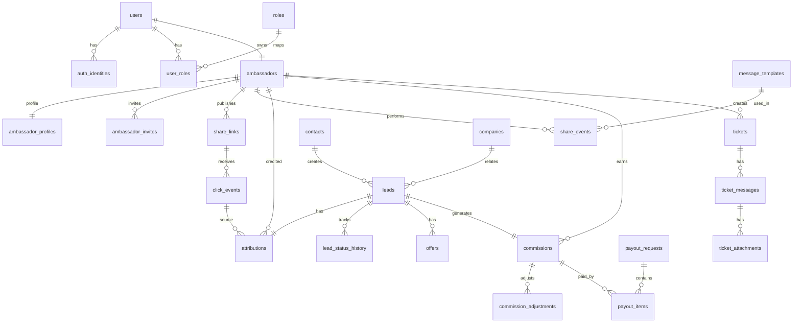
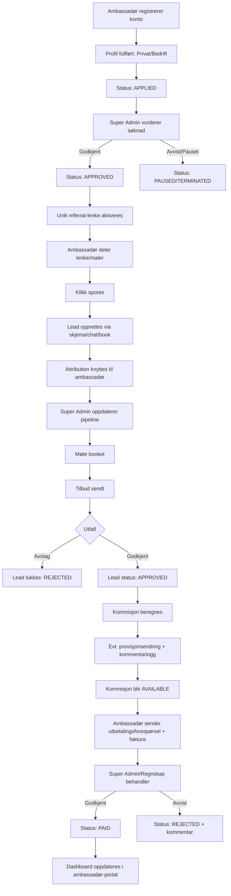

# Animer

Digital plattform for ambassadørdrevet lead-generering, salgspipeline og provisjonshåndtering for Animer.no.

## Feilsøking: `Firebase: Error (auth/unauthorized-domain)`

Denne feilen betyr at domenet brukeren logger inn fra ikke er whitelistet i Firebase Authentication.

### Slik fikser du det

1. Åpne **Firebase Console** for prosjektet ditt.
2. Gå til **Authentication → Settings → Authorized domains**.
3. Legg til domenet som brukes i produksjon, f.eks.:
   - `setai.no`
   - (ev.) `www.setai.no`
4. Hvis appen ligger på en undermappe (`/animer/2/`), trenger du fortsatt bare domenet (ikke hele URL-en).
5. Lagre, deploy på nytt ved behov, og test innlogging igjen.

### Ekstra sjekk

- Bekreft at `authDomain` i Firebase-konfigurasjonen peker til riktig Firebase-prosjekt.
- Kontroller at OAuth-provider (Google) er aktivert i **Authentication → Sign-in method**.

## Mål med løsningen

Løsningen støtter to hovedroller:

- **Ambassadør**: Deler unik lenke, skaper trafikk/leads, følger pipeline og inntekt.
- **Super Admin (Animer)**: Godkjenner ambassadører, følger opp leads, styrer provisjoner, utbetalinger og support.

---

## MVP-arkitektur (oversikt)

1. **Autentisering og onboarding**
   - Innlogging via Google/Vipps/SMS (leverandøravhengig implementasjon)
   - Profilutfylling (privatperson/bedrift)
   - Manuell godkjenning av ambassadør i Super Admin

2. **Referral og attribution**
   - Unik lenke per ambassadør (`/a/{ref_code}`)
   - Førsteklikk-attribution (first-click)
   - Attribution-vindu (f.eks. 90 dager)

3. **Lead og pipeline**
   - Klikk → kontakt → møte → tilbud sendt → godkjent/avslag
   - Sporbar kobling mellom lead og ambassadør

4. **Økonomi/provisjon**
   - Standard provisjon med mulighet for override per lead
   - Kommentarlogg for alle provisjonsendringer
   - Fakturaopplasting og utbetalingsstatus

5. **Support**
   - FAQ
   - Ticket-system med vedlegg

---

## Datamodell (tabeller + relasjoner)

Under er en anbefalt relasjonell datamodell (PostgreSQL-vennlig), designet for MVP med mulighet for utvidelser.

### 1) Brukere og roller

#### `users`
- `id` (PK, uuid)
- `email` (unique, nullable for SMS-only)
- `phone` (unique, nullable)
- `full_name`
- `avatar_url`
- `locale` (default `nb-NO`)
- `created_at`
- `updated_at`

#### `auth_identities`
- `id` (PK, uuid)
- `user_id` (FK -> `users.id`)
- `provider` (`google`, `vipps`, `sms`, ...)
- `provider_user_id`
- `created_at`

**Relasjon:** Én `user` kan ha flere innloggingsmetoder.

#### `roles`
- `id` (PK)
- `code` (`SUPER_ADMIN`, `ADMIN`, `ACCOUNTING`, `AMBASSADOR`)

#### `user_roles`
- `user_id` (FK -> `users.id`)
- `role_id` (FK -> `roles.id`)
- PK (`user_id`, `role_id`)

---

### 2) Ambassadører

#### `ambassadors`
- `id` (PK, uuid)
- `user_id` (FK -> `users.id`, unique)
- `status` (`APPLIED`, `APPROVED`, `PAUSED`, `TERMINATED`)
- `type` (`PRIVATE`, `BUSINESS`)
- `default_commission_pct` (numeric(5,2))
- `referral_code` (unique)
- `invites_enabled` (bool)
- `invite_limit` (int)
- `approved_by_user_id` (FK -> `users.id`, nullable)
- `approved_at` (nullable)
- `created_at`
- `updated_at`

#### `ambassador_profiles`
- `ambassador_id` (PK/FK -> `ambassadors.id`)
- `address`
- `postal_code`
- `city`
- `country`
- `organization_name` (nullable)
- `organization_number` (nullable)
- `billing_email` (nullable)
- `bio` (nullable)

#### `ambassador_invites`
- `id` (PK, uuid)
- `inviter_ambassador_id` (FK -> `ambassadors.id`)
- `invitee_email` (nullable)
- `invitee_phone` (nullable)
- `invite_code` (unique)
- `status` (`SENT`, `ACCEPTED`, `EXPIRED`, `REVOKED`)
- `created_at`
- `accepted_at` (nullable)

**Relasjon:** Ambassadør kan invitere nye ambassadører (second-tier).

---

### 3) Deling, trafikk og attribution

#### `share_links`
- `id` (PK, uuid)
- `ambassador_id` (FK -> `ambassadors.id`)
- `link_type` (`CUSTOMER`, `AMBASSADOR_INVITE`)
- `slug` (unique)
- `target_url`
- `active` (bool)
- `created_at`

#### `message_templates`
- `id` (PK, uuid)
- `template_scope` (`LEAD_GEN`, `AMBASSADOR_INVITE`)
- `channel` (`SMS`, `EMAIL`, `LINKEDIN`, `GENERIC`)
- `title`
- `subject` (nullable)
- `body`
- `active` (bool)
- `created_by_user_id` (FK -> `users.id`)
- `created_at`

#### `share_events`
- `id` (PK, uuid)
- `ambassador_id` (FK -> `ambassadors.id`)
- `share_link_id` (FK -> `share_links.id`)
- `template_id` (FK -> `message_templates.id`, nullable)
- `channel` (`COPY`, `SMS`, `EMAIL`, `SOCIAL`)
- `recipient_hash` (nullable)
- `created_at`

#### `click_events`
- `id` (PK, uuid)
- `share_link_id` (FK -> `share_links.id`)
- `ambassador_id` (FK -> `ambassadors.id`)
- `session_id`
- `is_direct_click` (bool)
- `utm_source` (nullable)
- `utm_medium` (nullable)
- `utm_campaign` (nullable)
- `ip_hash`
- `user_agent`
- `clicked_at`

#### `attributions`
- `id` (PK, uuid)
- `lead_id` (FK -> `leads.id`, unique)
- `ambassador_id` (FK -> `ambassadors.id`)
- `attribution_model` (`FIRST_CLICK`)
- `source_click_event_id` (FK -> `click_events.id`)
- `valid_until`
- `created_at`

---

### 4) Leads og salgsprosess

#### `companies`
- `id` (PK, uuid)
- `name`
- `organization_number` (nullable)
- `website` (nullable)
- `country` (nullable)
- `created_at`

#### `contacts`
- `id` (PK, uuid)
- `company_id` (FK -> `companies.id`, nullable)
- `first_name`
- `last_name`
- `email` (nullable)
- `phone` (nullable)
- `title` (nullable)
- `created_at`

#### `leads`
- `id` (PK, uuid)
- `contact_id` (FK -> `contacts.id`)
- `company_id` (FK -> `companies.id`, nullable)
- `source_type` (`CHAT`, `MEETING_BOOKING`, `CONTACT_FORM`, `BRIEF_FORM`)
- `status` (`OPEN`, `MEETING_BOOKED`, `OFFER_SENT`, `REJECTED`, `APPROVED`)
- `priority` (`LOW`, `MEDIUM`, `HIGH`)
- `owner_user_id` (FK -> `users.id`, nullable)
- `created_at`
- `updated_at`

#### `lead_status_history`
- `id` (PK, uuid)
- `lead_id` (FK -> `leads.id`)
- `from_status` (nullable)
- `to_status`
- `changed_by_user_id` (FK -> `users.id`)
- `comment` (nullable)
- `changed_at`

#### `offers`
- `id` (PK, uuid)
- `lead_id` (FK -> `leads.id`)
- `amount_ex_vat` (numeric)
- `currency` (default `NOK`)
- `sent_at`
- `approved_at` (nullable)
- `rejected_at` (nullable)

---

### 5) Provisjon, inntekt og utbetaling

#### `commissions`
- `id` (PK, uuid)
- `lead_id` (FK -> `leads.id`, unique)
- `ambassador_id` (FK -> `ambassadors.id`)
- `base_amount` (numeric)
- `commission_pct` (numeric(5,2))
- `commission_amount` (numeric)
- `status` (`PENDING`, `AVAILABLE`, `INVOICED`, `PAID`, `CANCELLED`)
- `created_at`
- `updated_at`

#### `commission_adjustments`
- `id` (PK, uuid)
- `commission_id` (FK -> `commissions.id`)
- `old_pct` (numeric(5,2))
- `new_pct` (numeric(5,2))
- `reason_comment` (text, required)
- `changed_by_user_id` (FK -> `users.id`)
- `changed_at`

#### `payout_requests`
- `id` (PK, uuid)
- `ambassador_id` (FK -> `ambassadors.id`)
- `requested_amount` (numeric)
- `invoice_file_url`
- `status` (`SUBMITTED`, `APPROVED`, `REJECTED`, `PAID`)
- `submitted_at`
- `processed_at` (nullable)
- `processed_by_user_id` (FK -> `users.id`, nullable)
- `comment` (nullable)

#### `payout_items`
- `payout_request_id` (FK -> `payout_requests.id`)
- `commission_id` (FK -> `commissions.id`)
- PK (`payout_request_id`, `commission_id`)

---

### 6) Support (FAQ + tickets)

#### `faq_categories`
- `id` (PK, uuid)
- `name_no`
- `sort_order`

#### `faq_articles`
- `id` (PK, uuid)
- `category_id` (FK -> `faq_categories.id`)
- `question_no`
- `answer_no`
- `active` (bool)
- `sort_order`

#### `tickets`
- `id` (PK, uuid)
- `ambassador_id` (FK -> `ambassadors.id`)
- `reason` (`TECHNICAL`, `COMMISSION`, `PAYOUT`, `OTHER`)
- `subject`
- `status` (`OPEN`, `IN_PROGRESS`, `RESOLVED`, `CLOSED`)
- `created_at`
- `updated_at`

#### `ticket_messages`
- `id` (PK, uuid)
- `ticket_id` (FK -> `tickets.id`)
- `sender_user_id` (FK -> `users.id`)
- `message`
- `created_at`

#### `ticket_attachments`
- `id` (PK, uuid)
- `ticket_message_id` (FK -> `ticket_messages.id`)
- `file_url`
- `file_type`
- `file_size`

---

## Relasjonsdiagram (ERD - forenklet)



---

## SUPER ADMIN → Ambassadør flyt-diagram



---

## Forslag til MVP avgrensning (anbefalt)

For å komme raskt i produksjon:

- **Inkluder i MVP:**
  - Ambassadør onboarding + manuell godkjenning
  - Unik lenke + klikksporing
  - Lead-statusflyt
  - Grunnleggende provisjonsberegning
  - Fakturaopplasting + utbetalingsstatus
  - FAQ + enkel tickets

- **Flytt til V2:**
  - Direkteintegrasjoner mot Messenger/Instagram
  - Kontaktimport fra telefon
  - Avansert A/B-testing av tekster
  - Multinivå kommisjon (utover enkel invitering)


## HTML walkthrough / presentasjon

Det ligger en enkel statisk HTML-presentasjon i `walkthrough/`:

- `walkthrough/index.html` – oversikt
- `walkthrough/ambassador.html` – ambassadør dashboard
- `walkthrough/admin.html` – super admin pipeline
- `walkthrough/payout-support.html` – utbetaling og support

For å vise sidene lokalt:

```bash
python3 -m http.server 8000
# åpne http://localhost:8000/walkthrough/
```
